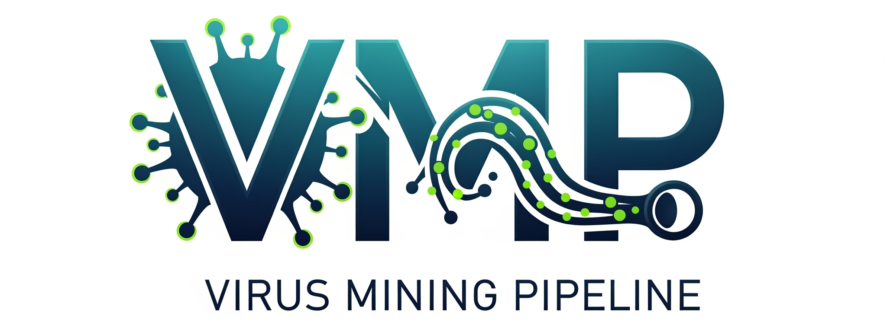
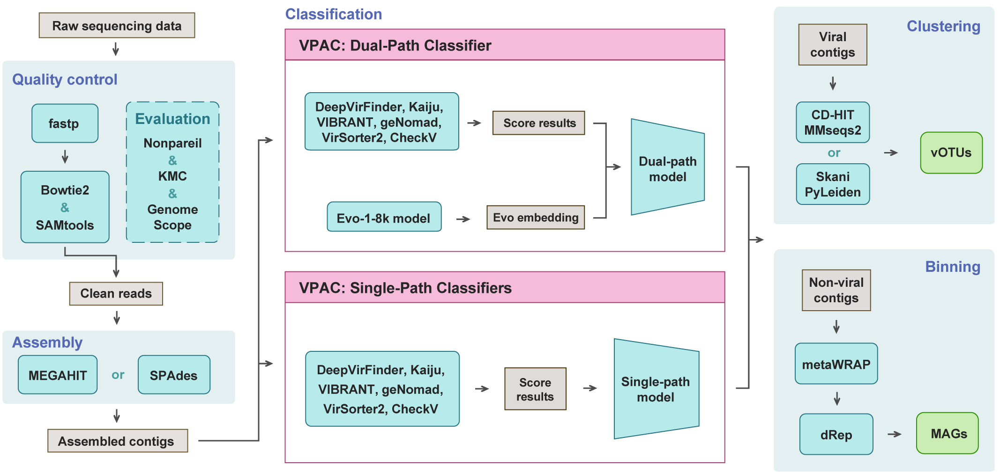

<div align="center">





 


</div>

- [VMP](#VMP)
  - [Description](#description)
  - [Installation](#installation)
    - [Clone the source code](#clone-the-source-code)
    - [Create the conda environment](#create-the-conda-environment)
    - [Prepare required databases, tools and models](#prepare-required-databases-tools-and-models)
    - [Prepare the config file](#prepare-the-config-file)
  - [Quick Start](#quick-start)
    - [Automated Run](#automated-run)
    - [Quality Control](#quality-control)
    - [Assembly](#assembly)
    - [Viral Contig Identification](#viral-contig-identification)
    - [Clustering](#clustering)
    - [Binning](#binning)
  - [Citing this work](#citing-this-work)
  - [Acknowledgments](#acknowledgments)
  - [Contacts](#Contacts)

  
  

## Description

The **VMP (Virus Mining Pipeline)** is a modular and automated pipeline for mining viral genomes from raw microbiome data.
It integrates state-of-the-art tools for **quality control, assembly, viral contigs identification (our self-developed VPAC), clustering of viral genomes (vOTUs), and binning of microbial genomes (MAGs)**.
With its AI-empowered classifier VPAC, VMP provides both high accuracy and scalability across diverse microbiomes.

  
    

## Installation


### Clone the source code

```bash
git clone https://github.com/Basspoom/VMP.git
cd VMP
```


### Create the conda environment

The VMP uses four separate Conda environments to manage dependencies effectively. The `environment` files are located in the `VMP/environments` directory.

```bash
conda env create -f environments/VMP.yml -n VMP
conda env create -f environments/VPAC-single.yml -n VPAC-single
conda env create -f environments/VPAC-dual.yml -n VPAC-dual
conda env create -f environments/Binning.yml -n Binning
```


### Prepare required databases, tools and models

The VMP relies on several external databases, several tools, and pre-trained models. Please make sure to download and configure them before the first run. The dependencies of each module are summarized below:

1. **Quality Control**: 
 - Host decontamination database (e.g., human reference genome hg38: http://igenomes.illumina.com.s3-website-us-east-1.amazonaws.com/Homo_sapiens/UCSC/hg38/Homo_sapiens_UCSC_hg38.tar.gz).
 - GenomeScope tool: https://github.com/schatzlab/genomescope/
2. **Assembly**: No external databases required.
3. **Viral Contig Identification**: 
 - DeepVirFinder tool: https://github.com/jessieren/DeepVirFinder/ 
 - VirSoeter2 database: https://osf.io/v46sc/download/ 
 - VIBRANT database: https://github.com/AnantharamanLab/VIBRANT/blob/master/
 - CheckV database: https://pypi.com.cn/project/checkv/
 - Kaiju database: https://github.com/bioinformatics-centre/kaiju/tree/master
 - geNomad database: https://github.com/apcamargo/genomad/
 - VPAC models: available via Zenodo https://zenodo.org/records/17008739  
 - Evo model: available via Zenodo https://zenodo.org/uploads/14033148 
4. **Clustering**: No external databases required.
5. **Binning**: No external databases required.

**Users can run the script under the `VMP/dependency/` directory to automatically download and configure all required files:**
```bash
cd VMP/dependency
python prepare_database.py -db all
```

This script will fetch and set up all dependencies listed above.
- Estimated time: 5~10 hours (depending on your network bandwidth).
- Disk space required: ~ 130 GB.
- Typically, users only need to run this step once before the first use.


**Optional:**   Enable Faster Downloading with aria2c
If available, the script can use `aria2c` for parallel accelerated downloading (no root required):
```bash
conda install -c conda-forge aria2
python prepare_database.py -db all -aria2
```

**Optional:**   Remove compressed packages after installation
Add the `-clean` flag:
```bash
python prepare_database.py -db all -aria2 -clean
```

If some databases were already downloaded, users can specify only the missing ones. For example:
```bash
python prepare_database.py -db VirSorter2,CheckV,geNomad --aria2
```

###  Prepare the config file
Before run VMP, you should update the paths of the environments, databases, tools and models in your VMP/config.yml file to ensure VMP can properly locate them, for example:
> ```yml
> # env
> VMP_env: '/home/user/miniforge3/envs/your_VMP_env/'
> VPAC_single: '/home/user/miniforge3/envs/your_VPAC-single_env'
> VPAC_dual: '/home/user/miniforge3/envs/your_VPAC-dual_env'
> Binning: '/home/user/miniforge3/envs/your_Binning_env'
>
> # dbs
> VIBRANT_db: '~/VMP/dependency/databases/VIBRANT_db'
> CheckV_db: '~/VMP/dependency/databases/CheckV_db'
> Kaiju_db: '~/VMP/dependency/databases/Kaiju_db'
> geNomad_db: '~/VMP/dependency/databases/geNomad_db'
> checkM_db: '~/VMP/dependency/databases/checkM_db'
> VirSorter2_db: '~/VMP/dependency/databases/VirSorter2_db'
> host_genome: '~/VMP/dependency/databases/host_genome/Homo_sapiens'
>
> # tools
> DeepVirFinder: '~/VMP/dependency/tools/DeepVirFinder'
> genomescope2.0: '~/VMP/dependency/tools/genomescope2.0'
>
> # models
> VPAC_models: '~/VMP/dependency/models/VPAC_models'
> Evo_models: '~/VMP/dependency/models/Evo'
>
> ```

  
  


## Quick Start

The VMP is composed of seven modular scripts plus one orchestration script for fully automated execution. Each script corresponds to a major step in the virus mining workflow:

- `VMP_end2end.py`  Orchestration script. Runs the entire pipeline (QC → Assembly → Viral Identification → Clustering → Binning) starting from raw reads.
- `QC.py`  Performs quality control and host decontamination on raw sequencing reads.
- `Assembly.py`  Assembles cleaned reads into contigs using either MEGAHIT or SPAdes.
- `VPAC_single.py`  Identifies viral contigs with the computationally efficient single-path classifier.
- `VPAC_dual.py`  Identifies viral contigs with the more accurate Evo-enhanced dual-path classifier.
- `Clustering.py`  Groups viral contigs into vOTUs using CD-HIT/MMseqs2 or Skani/PyLeiden.
- `Binning.py`  Bins non-viral contigs into microbial genomes (MAGs) using metaWRAP and dRep.

These scripts can be executed independently for modular analysis, or sequentially combined for a complete workflow. The relationship is illustrated below:

```sql
Raw Reads → QC.py → Assembly.py → VPAC_single.py / VPAC_dual.py → Clustering.py → Binning.py ————→ vOTUs and MAGs
        |
        └──────────→ VMP_end2end.py (automated full pipeline) ————→ vOTUs and MAG
```

**The overall workflow is shown as follow :**



In the following sections, we introduce each script with a **Command Template** and a **Results Description**. For simplicity, only the core arguments are shown. For the full list of parameters, run:
```bash
conda activate your_env
python ~/VMP/bin/<script>.py -h
```
  

### Automated Run 

`VMP_end2end.py`

Runs the **full pipeline** starting from raw sequencing reads, including quality control, assembly, viral contig identification, clustering, and binning. This script produces viral gemones (vOTUs) and microbial genomes (MAGs) in a single step.

#### Command Template:
```bash
conda activate Your_VMP_env
python ~/VMP/bin/VMP_end2end.py  -i xx/VMP/examples -o xx/outdir -cf xx/VMP/config.yml --assembly megahit --vpac both --cluster skani_pyleiden

# Two assembly methods you can chose: 'SPAdes' or 'MEGAHIT' (default: SPAdes).
# Two virus identification methods you can chose:'single' or 'dual' (default: dual).
# Two clustering methods you can chose: 'CD-hit + MMseqs2' or 'skani + pyLeiden' (default: skani + pyLeiden).
```

*For more detailed parameters, run:*
```bash
conda activate Your_VMP_env
python ~/VMP/bin/VMP_end2end.py -h
```

You can use `--resume (default)` or `--no-resume` to auto-detect completed steps and continue, and use `--from-step {qc|assembly|vpac_single|vpac_dual|clustering}` to override this behavior and start from a specific step!

#### Results:
- Clean reads (after QC)
- Assembled contigs
- Viral contig predictions (VPAC outputs)
- Clustered vOTUs
- MAG bins
- Summary reports (statistics files and figures)


  

### Quality Control

`QC.py`

Performs quality control on raw reads, including adapter trimming, quality filtering, host contamination removal, and sequencing complexity assessment.

#### Command Template:
```bash
conda activate Your_VMP_env
python ~/VMP/bin/QC.py -cf ~/VMP/config.yml -r ~/VMP/examples/ --output_dir ~/VMP/try -p 80
```

*For more detailed parameters, run:*
```bash
conda activate Your_VMP_env
python ~/VMP/bin/QC.py -h
```

#### Results:
- Filtered clean reads
- QC report (Q20, Q30, sequencing depth, k-mer profile, coverage estimation)


  

### Assembly

`Assembly.py`

Assembles the cleaned reads into contigs using **MEGAHIT** or **SPAdes** (user selectable).

#### Command Template:
```bash
conda activate Your_VMP_env
# MEGAHIT
python ~/VMP/bin/Assembly.py -cf ~/VMP/config.yml -r ~/xxx/Clean_reads/ -out ~/xxx/contigs -p 80 --tool megahit 
# SPAdes
python ~/VMP/bin/Assembly.py -cf ~/VMP/config.yml -r ~/xxx/Clean_reads/ -out ~/xxx/contigs -p 80 --tool spades --metaviral --spades-memory 500 

```

*For more detailed parameters, run:*
```bash
conda activate Your_VMP_env
python ~/VMP/bin/Assembly.py -h
```

#### Results:
- Assembled contigs (FASTA)
- Assembly statistics (number of contigs, N50, average length)


  

### Viral Contig Identification

 `VPAC-single.py`

Users can choose one of the eight **VPAC single-path classifiers** to identify viral vs. non-viral contigs. Computationally lightweight and efficient, suitable for large datasets or limited resources.


#### Command Template:
```bash
conda activate Your_VPAC-single_env
python ~/VMP/bin/VPAC-single.py -cf ~/VMP/config.yml -i ~/xxx/raw_contigs/ -o ~/xxx/out_contigs -t 80 -lmin 3000 -lmax 100000  --parallel 1 -m FNN
### You can choose model one of: CNN, FNN, GB, KAN, RF, SVC, VAE, AE
```

*For more detailed parameters, run:*
```bash
conda activate Your_VPAC-single_env
python ~/VMP/bin/VPAC-single.py -h
```

#### Results:
- Viral contig predictions
- Classification probability scores
- Summary report


`VPAC-dual.py`

Runs the **VPAC dual-path classifier**, integrating viral scoring system and Evo-based embeddings for higher accuracy. Requires GPUs with large memory.
**You must run `VPAC-single.py` before `VPAC-dual.py`, and their output directories must remain consistent.**

### Command Template:
```bash
conda activate Your_VPAC-dual_env
python ~/VMP/bin/VPAC-dual.py -i ~/xxx/raw_contigs/ -o ~/xxx/out_contigs -d cuda:0 -cf ~/VMP/config.yml 
```

*For more detailed parameters, run:*
```bash
conda activate Your_VPAC-dual_env
python ~/VMP/bin/VPAC-dual.py -h
```

#### Results:
- Viral contig predictions
- Classification probability scores
- Summary report

#### Important issue:
If you encounter `NameError: name 'MHA' is not defined`, it typically means the FlashAttention build matching your Python/Torch/CUDA versions is missing. Activate your VPAC-dual environment (`conda activate Your_VPAC-dual_env`), check versions with conda list, download the correct wheel from the FlashAttention releases page(https://github.com/Dao-AILab/flash-attention/releases), upload it to the server, and install it via pip install `./flash_attn-*.whl`.

  

### Clustering

 `Clustering.py`

Clusters **viral contigs** into vOTUs using either ***CD-HIT + MMseqs2*** or ***Skani + PyLeiden***.


#### Command Template:
```bash
conda activate Your_VMP_env
python ~/VMP/bin/Clustering.py -i ~/xxx/raw_contigs/ -o ~/xxx/out_vOTUs -cf ~/VMP/config.yml  --tool skani_pyleiden --parallel 2 
```

*For more detailed parameters, run:*
```bash
conda activate Your_VMP_env
python ~/VMP/bin/Clustering.py -h
```

#### Results:
- Clustered vOTUs (FASTA + cluster assignments)
- Redundancy-reduced viral genome sets
- Summary statistics (cluster sizes, ANI distributions)


  

### Binning

`Binning.py`

Bins **non-viral contigs** into MAGs using ***SemiBin2***, check quality by ***CheckM2*** and dereplication with ***dRep***.


#### Command Template:
```bash
conda activate Your_Binning_env
python ~/VMP/bin/Binning.py -r ~/xxx/Clean_reads -i ~/xxx/raw_contigs/ -out ~/xxx/out_Bins -cf ~/VMP/config.yml --minfasta-kb 50 --min-len 500 --min-completeness 70 --max-contamination 5
```

*For more detailed parameters, run:*
```bash
conda activate Your_Binning_env
python ~/VMP/bin/Binning.py -h
```

#### Results:
- Draft microbial genomes (MAGs)
- Dereplicated genome sets
- Binning quality assessment (completeness, contamination)


  
  


## Citing this work
```bash
*@article {xxxx,
    author = {Bai, Zi-Peng and Zhao, Heng-Rui and Zhang, Ling-yu and Li, Bo-Rui and Chen, Yuxing and Qiong, Li and Zhou, Cong-Zhao},
    title = {VMP: an AI-empowered pipeline for mining viruses in microbiomes},
    elocation-id = {xxx},
    year = {2025},
    doi = {xxx},
    publisher = {xxx},
    URL = {xxx},
    eprint = {xxx},
    journal = {Microbiome}
}
```

  
  

## Acknowledgments

We acknowledge ***Hefei HiDimension Biotechnology Co., Ltd.*** for providing technical assistance and resources!!! 🥰

  
  

## Contacts

We are honored to help you if you have any questions. Please feel free to open an issue or contact us directly. Hope our code helps and look forward to your citations.

[basspoom@mail.ustc.edu.cn] | [zhr123456@mail.ustc.edu.cn].
