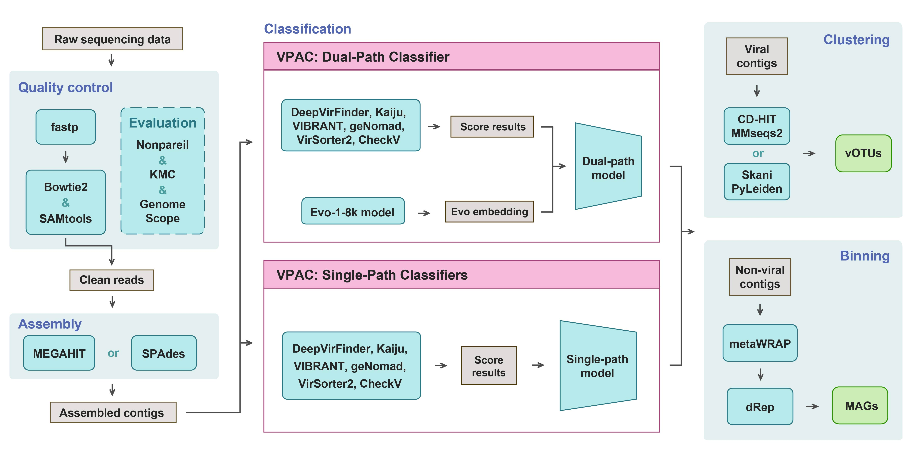

<div align="center">


 


</div>

- [VMP](#VMP)
  - [Description](#description)
  - [Installation](#installation)
    - [Clone the source code](#clone-the-source-code)
    - [Create the conda environment](#create-the-conda-environment)
    - [Prepare required databases, VPAC models and the config file](#prepare-required-databases-VPAC-models-and-the-config-file)
  - [Quick Start](#quick-start)
    - [Automated Run](#automated-run)
    - [Quality Control](#quality-control)
    - [Assembly](#assembly)
    - [Viral Contig Identification](#viral-contig-identification)
    - [Clustering](#clustering)
    - [Binning](#binning)
  - [Citing this work](#citing-this-work)
  - [Acknowledgments](#acknowledgments)
  - [Contacts](#Contacts)

  
  

## Description

The **VMP (Virus Mining Pipeline)** is a modular and automated pipeline for mining viral genomes from raw microbiome data.
It integrates state-of-the-art tools for **quality control, assembly, viral contigs identification (our self-developed VPAC), clustering of viral genomes (vOTUs), and binning of microbial genomes (MAGs)**.
With its AI-empowered classifier VPAC, VMP provides both high accuracy and scalability across diverse microbiomes.

  
    

## Installation


### Clone the source code

```bash
git clone https://github.com/Basspoom/VMP.git
cd VMP
```


### Create the conda environment

The VMP uses four separate Conda environments to manage dependencies effectively. The `environment` files are located in the `VMP/environments` directory.

```bash
conda env create -f environments/VMP.yml -n VMP
conda env create -f environments/VPAC-single.yml -n VPAC-single
conda env create -f environments/VPAC-dual.yml -n VPAC-dual
conda env create -f environments/Binning.yml -n Binning
```


### Prepare required databases, VPAC models and the config file

The VMP relies on several external databases and pre-trained models. Please make sure to download and configure them before the first run. The dependencies of each module are summarized below:

1. **Quality Control**: Host decontamination database (e.g., human reference genome hg38).
2. **Assembly**: No external databases required.
3. **Viral Contig Identification**: 
 - VIBRANT database: https://github.com/AnantharamanLab/VIBRANT/blob/master/
 - CheckV database: https://pypi.com.cn/project/checkv/
 - Kaiju database: https://github.com/bioinformatics-centre/kaiju/tree/master
 - geNomad database: https://github.com/apcamargo/genomad/
 - VPAC models: available via Zenodo https://zenodo.org/uploads/14033148  ***including single- and dual-path classifiers; Evo pre-trained models with path, model, and config***
4. **Clustering**: No external databases required.
5. **Binning**: No external databases required.

Users can run the script under the `VMP/dependency/` directory to automatically download and configure all required files:
```bash
cd VMP/dependency
python prepare_database.py -db all
```

This script will fetch and set up all dependencies listed above.
- Estimated time: ~ xxx hours (depending on your network bandwidth).
- Disk space required: ~ xxx GB.
- Typically, users only need to run this step once before the first use.


**Optional:**   Enable Faster Downloading with aria2c
If available, the script can use `aria2c` for parallel accelerated downloading (no root required):
```bash
conda install -c conda-forge aria2
python prepare_database.py -db all -aria2
```

**Optional:**   Remove compressed packages after installation
Add the `-clean` flag:
```bash
python prepare_database.py -db all -aria2 -clean
```

If some databases were already downloaded, users can specify only the missing ones. For example:
```bash
python prepare_database.py -db VirSorter2,CheckV,geNomad --aria2
```

After downloading, update the paths of databases in your VMP/config.yml file to ensure VMP can properly locate these databases and models, for example:
> ```yml
> paths:
>    VIBRANT_db: 'VMP/databases/VIBRANT_db'
>    CheckV_db: 'VMP/databases/CheckV_db'
>    Kaiju_db: '/your/path/to/Kaiju_db'
>    geNomad_db: '/your/path/to/geNomad_db'
>    VPAC_models: 'VMP/databases/VPAC_models'
> ```

  
  


## Quick Start

The VMP is composed of seven modular scripts plus one orchestration script for fully automated execution. Each script corresponds to a major step in the virus mining workflow:

- `end2end.py`  Orchestration script. Runs the entire pipeline (QC → Assembly → Viral Identification → Clustering → Binning) starting from raw reads.
- `QC.py`  Performs quality control and host decontamination on raw sequencing reads.
- `Assembly.py`  Assembles cleaned reads into contigs using either MEGAHIT or SPAdes.
- `VPAC_single.py`  Identifies viral contigs with the computationally efficient single-path classifier.
- `VPAC_dual.py`  Identifies viral contigs with the more accurate Evo-enhanced dual-path classifier.
- `Clustering.py`  Groups viral contigs into vOTUs using CD-HIT/MMseqs2 or Skani/PyLeiden.
- `Binning.py`  Bins non-viral contigs into microbial genomes (MAGs) using metaWRAP and dRep.

These scripts can be executed independently for modular analysis, or sequentially combined for a complete workflow. The relationship is illustrated below:

```sql
Raw Reads → QC.py → Assembly.py → VPAC_single.py / VPAC_dual.py → Clustering.py → Binning.py ————→ vOTUs and MAGs
        |
        └──────────→ end2end.py (automated full pipeline) ————→ vOTUs and MAG
```

**The overall workflow is shown as follow :**



In the following sections, we introduce each script with a **Command Template** and a **Results Description**. For simplicity, only the core arguments are shown. For the full list of parameters, run:
```bash
python <script>.py -h
```
  

### Automated Run 

`end2end.py`

Runs the **full pipeline** starting from raw sequencing reads, including quality control, assembly, viral contig identification, clustering, and binning. This script produces viral gemones (vOTUs) and microbial genomes (MAGs) in a single step.

#### Command Template:
```bash
python end2end.py  --config_path ~/VMP/config.yml  --input ~/VMP/examples/sample.fastq.gz  --output_dir ~/VMP/examples/example_run_outputs
```

*For more detailed parameters, run:*
```bash
python end2end.py -h
```


#### Results:
- Clean reads (after QC)
- Assembled contigs
- Viral contig predictions (VPAC outputs)
- Clustered vOTUs
- MAG bins
- Summary reports (statistics files and figures)


  

### Quality Control

`QC.py`

Performs quality control on raw reads, including adapter trimming, quality filtering, host contamination removal, and sequencing complexity assessment.

#### Command Template:
```bash
conda activate VMP
python QC.py --config_path ~/VMP/config.yml --input_reads ~/VMP/examples/sample.fastq.gz --output_dir ~/VMP/examples/example_run_outputs/qc_run
```

*For more detailed parameters, run:*
```bash
python QC.py -h
```


#### Results:
- Filtered clean reads
- QC report (Q20, Q30, sequencing depth, k-mer profile, coverage estimation)


  

### Assembly

`Assembly.py`

Assembles the cleaned reads into contigs using **MEGAHIT** or **SPAdes** (user selectable).

#### Command Template:
```bash
conda activate VMP
python Assembly.py --config_path ~/VMP/config.yml --input_reads ~/VMP/examples/example_run_outputs/qc_run/clean_reads.fq.gz --assembler megahit  --output_dir ~/VMP/examples/example_run_outputs/assembly_run

```

*For more detailed parameters, run:*
```bash
python Assembly.py -h
```


#### Results:
- Assembled contigs (FASTA)
- Assembly statistics (number of contigs, N50, average length)


  

### Viral Contig Identification

 `VPAC-single.py`

Users can choose one of the eight **VPAC single-path classifiers** to identify viral vs. non-viral contigs. Computationally lightweight and efficient, suitable for large datasets or limited resources.


#### Command Template:
```bash
conda activate VPAC-single
python VPAC-single.py --config_path ~/VMP/config.yml --input_contigs ~/VMP/examples/example_run_outputs/assembly_run/contigs.fasta --output_dir ~/VMP/examples/example_run_outputs/vpac_single_run
```

*For more detailed parameters, run:*
```bash
python VPAC-single.py -h
```


#### Results:
- Viral contig predictions
- Classification probability scores
- Summary report


`VPAC-dual.py`

Runs the **VPAC dual-path classifier**, integrating viral scoring system and Evo-based embeddings for higher accuracy. Requires GPUs with large memory.

#### Command Template:
```bash
conda activate VPAC-dual
python VPAC-dual.py --config_path ~/VMP/config.yml --input_contigs ~/VMP/examples/example_run_outputs/assembly_run/contigs.fasta --output_dir ~/VMP/examples/example_run_outputs/vpac_dual_run
```

*For more detailed parameters, run:*
```bash
python VPAC-dual.py -h
```

#### Results:
- Viral contig predictions
- Classification probability scores
- Summary report


  

### Clustering

 `Clustering.py`

Clusters **viral contigs** into vOTUs using either ***CD-HIT + MMseqs2*** or ***Skani + PyLeiden***.


#### Command Template:
```bash
conda activate VMP
python Clustering.py --input_viral_contigs ~/VMP/examples/example_run_outputs/vpac_dual_run/viral_contigs.fasta  --output_dir ~/VMP/examples/example_run_outputs/clustering_run```
```

*For more detailed parameters, run:*
```bash
python Clustering.py -h
```

#### Results:
- Clustered vOTUs (FASTA + cluster assignments)
- Redundancy-reduced viral genome sets
- Summary statistics (cluster sizes, ANI distributions)


  

### Binning

`Binning.py`

Bins **non-viral contigs** into MAGs using ***metaWRAP*** and dereplication with ***dRep***.


#### Command Template:
```bash
conda activate Binning
python Binning.py --input_nonviral_contigs ~/VMP/examples/example_run_outputs/vpac_dual_run/nonviral_contigs.fasta  --output_dir ~/VMP/examples/example_run_outputs/binning_run
```

*For more detailed parameters, run:*
```bash
python Binning.py -h
```

#### Results:
- Draft microbial genomes (MAGs)
- Dereplicated genome sets
- Binning quality assessment (completeness, contamination)


  
  


## Citing this work
```bash
*@article {xxxx,
    author = {Bai, Zi-Peng and Zhao, Heng-Rui and Zhang, Ling-yu and Li, Bo-Rui and Chen, Yuxing and Qiong, Li and Zhou, Cong-Zhao},
    title = {VMP: an AI-empowered pipeline for mining viruses in microbiomes},
    elocation-id = {xxx},
    year = {2025},
    doi = {xxx},
    publisher = {xxx},
    URL = {xxx},
    eprint = {xxx},
    journal = {Microbiome}
}
```

  
  

## Acknowledgments

We acknowledge ***Hefei HiDimension Biotechnology Co., Ltd.*** for providing technical assistance and resources!!! 🥰

  
  

## Contacts

We are honored to help you if you have any questions. Please feel free to open an issue or contact us directly. Hope our code helps and look forward to your citations.

[zcz@ustc.edu.cn] | [basspoom@mail.ustc.edu.cn] | [zhr123456@mail.ustc.edu.cn].
